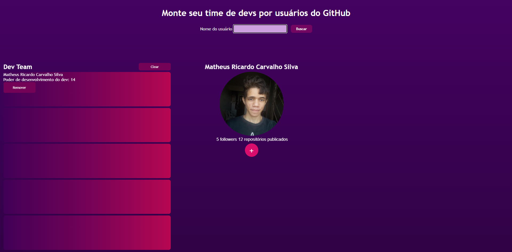
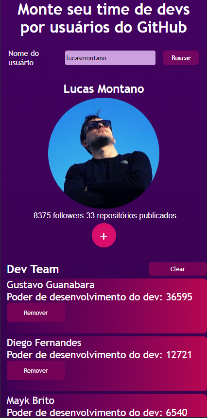
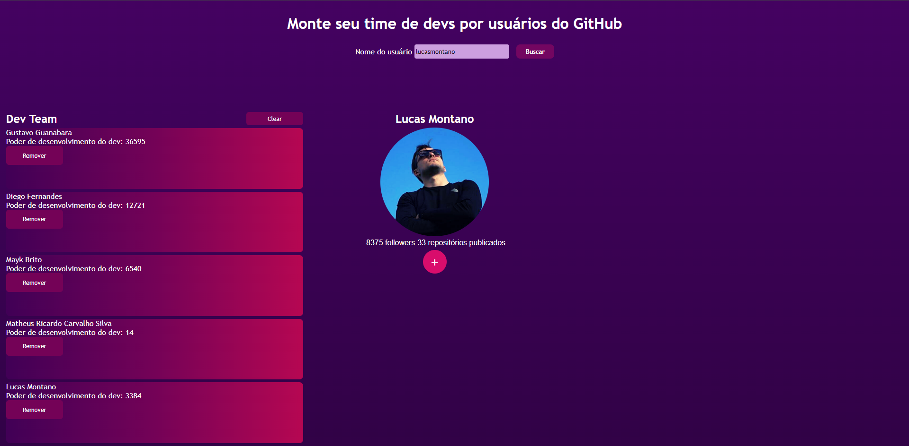

# Powerful-Dev-Team-React

<h4> Crie sua própria equipe de desenvolvedores com usuários do GitHub, busque por qualquer um e adicione à sua equipe para ganhar pontos </h4>

<p style="text-align: center">Um projeto que trabalha com a API do GitHub</p>

## Tecnologias Utilizadas
- **React**: Biblioteca JavaScript para construção de interfaces de usuário.
- **Axios**: Para fazer requisições HTTP à API do GitHub.
- **CSS**: Para estilização do aplicativo.
- **Typescript**: Linguagem de programação para melhorar a segurança e a escalabilidade do código, garantindo a tipagem estática e a prevenção de erros.

## Imagens do Aplicativo
### Tela Principal (Mobile)


### Tela Principal


### Time pronto ! (Mobile)


### Time pronto !


## Elementos CSS Utilizados
- **Grid**: Utilizado para criar layouts responsivos e organizar os elementos na tela.
- **Unidades de Medida**:
  - `rem`: Usado para definir tamanhos de fonte e espaçamentos, garantindo escalabilidade e acessibilidade.
  - `vh` e `vw`: Utilizados para definir alturas e larguras relativas à altura e largura da viewport.
- **Flexbox**: Utilizado em várias classes para alinhar e distribuir espaço entre os itens de forma eficiente.
- **Transições e Animações**: Aplicadas em botões e elementos interativos para melhorar a experiência do usuário.


## Como Rodar o Projeto Localmente
1. Clone o repositório:
   ```bash
   git clone https://github.com/MatheusRicardoCarvalho/Powerful-DevTeam-React.git
   ```
2. Navegue até o diretório do projeto:
   ```bash
   cd Powerful-DevTeam-React
   ```
3. Instale as dependências:
   ```bash
   npm install
   ```
4. Inicie o servidor de desenvolvimento:
   ```bash
   npm start
   ```
